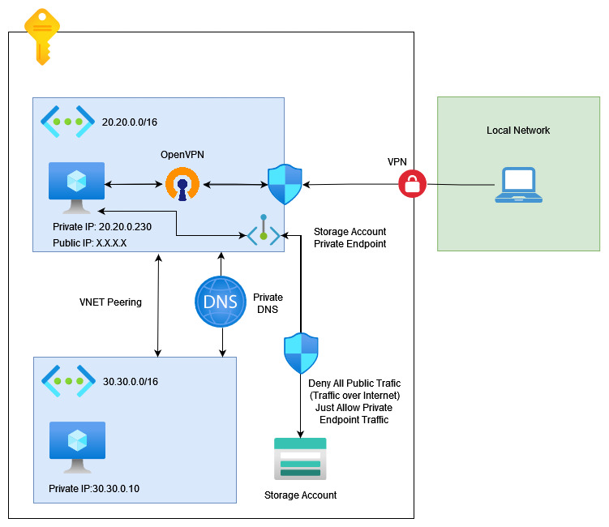

# OpenVPN - POC

This project intends to build a VPN using OpenVPN, it is desired to build de following network topology:



## Setup
---

- [Create an Azure Account](https://azure.microsoft.com/en-us/free/)
- [Install TF_ENV](https://github.com/tfutils/tfenv)
- Public and Private SSH Key located on `~/.ssh/id_rsa.pub` and `~/.ssh/id_rsa`
- [Install OpenVPN Client](https://openvpn.net/client-connect-vpn-for-windows/)

---

## How it Works ?

At this user case, a user outside the vnet network will be able to connect with the OpenVPN Server (20.20.0.230) using the server's public IP, and when the vpn connection is established he will be able to access both VM instances (20.20.0.230 and 30.30.0.10) using their private ip. Notice that there is a Vnet peering between the two vnets.

Also, the user will be able to query the private DNS (vpn.internal) and access the storage account privately using the Azure Private Endpoint. The storage account will be configured to reject all connection from public network.

---

## Usage

This environment is totally build using [Terraform](https://www.terraform.io/)

```bash
cd src/terraform
tfenv install
tfenv use
terraform init
terraform apply
```

## Connecting to VPN

First of all, will be necessary to execute a shell script at OpenVpn server using SSH in order to generate an user certificate

```bash
# executes the shell script to create the client certificate
# ssh <openvpn-vm-user>@<vm-public-ip> 'bash client-configs/make_config.sh <client-name>'
ssh adminuser@13.68.155.51 'bash client-configs/make_config.sh tiago.missao'

# downloads the generated client certificate
# ssh <openvpn-vm-user>@<vm-public-ip>:client-configs/files/<client-name>.ovpn .
sftp adminuser@13.68.155.51:client-configs/files/tiago.missao.ovpn .
```

After that, move the created certificate to the OpenVpn Client configuration folder ( on windows it will be `C:\Program Files\OpenVPN\config`) and initiate the connection on the OpenVpn Client

## Results
---


## Special Thanks

I would like to register my special thanks to [Leonardo Mendes](https://github.com/leonardomoraesmendes) for the insight with Bind9 and the DNS forward architecture.

## References
---

- [`Setup OpenVPN on Ubuntu 20.04`](https://www.digitalocean.com/community/tutorials/how-to-set-up-and-configure-an-openvpn-server-on-ubuntu-20-04)

- [`Setup Certificate Authority on Ubuntu 20.04`](https://www.digitalocean.com/community/tutorials/how-to-set-up-and-configure-a-certificate-authority-ca-on-ubuntu-20-04)

- [`Azure Private Endpoints Tutorial`](https://jfarrell.net/2021/07/03/private-endpoints-with-terraform/)

- [`Setup Bind9 on Ubuntu`](https://linuxhint.com/install_bind9_ubuntu/) 

- [`Configuring Bind9 to Resolve Azure Private DNS`](https://stackoverflow.com/questions/55347781/is-it-possible-to-setup-dns-forwarding-using-bind9-that-translates-dns-suffix)

- [`Azure DNS Forwarder`](https://docs.microsoft.com/en-us/azure/private-link/private-endpoint-dns) 

- [`Azure DNS Resolver`](https://docs.microsoft.com/en-us/azure/virtual-network/what-is-ip-address-168-63-129-16)